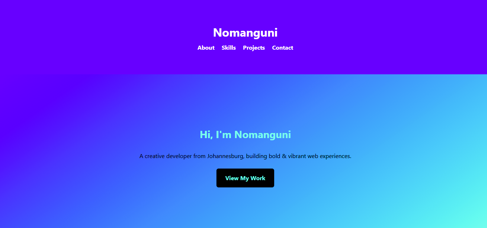

# Nomanguni Creative Portfolio

A bold and creative personal portfolio for Nomanguni, a developer based in Johannesburg.

## 📸 Screenshot



## 💡 Features

- Vibrant color scheme and unique typography
- Responsive navigation bar
- Portfolio gallery
- Scroll-to-top button
- Smooth transitions

## 🛠 Technologies

- HTML5
- CSS3
- JavaScript

## 🚀 Getting Started

1. Download the repo or extract the zip

**Clone the Repository**
   ```
   git clone https://github.com/Nomahk25/nomanguni-portfolio.git
   cd nomanguni-portfolio
```
3. Open `index.html` in your browser

## 💡 Inspiration

This portfolio is inspired by bold, minimal developer landing pages with a touch of personality. I wanted something that reflects creativity while staying professional.

## 🤝 Contributing

Feel free to fork the project, improve it, and submit pull requests!

Ideas:

- Add a dark/light mode toggle
- Integrate a contact form 
- Animate section transitions
- Add downloadable resume

## 📬 Contact

Made with love by Nomanguni Khumalo
📍 Johannesburg, South Africa
Email: nomangunik25@gmail.com

## 📜 License

This project is open source and available under the MIT License.
